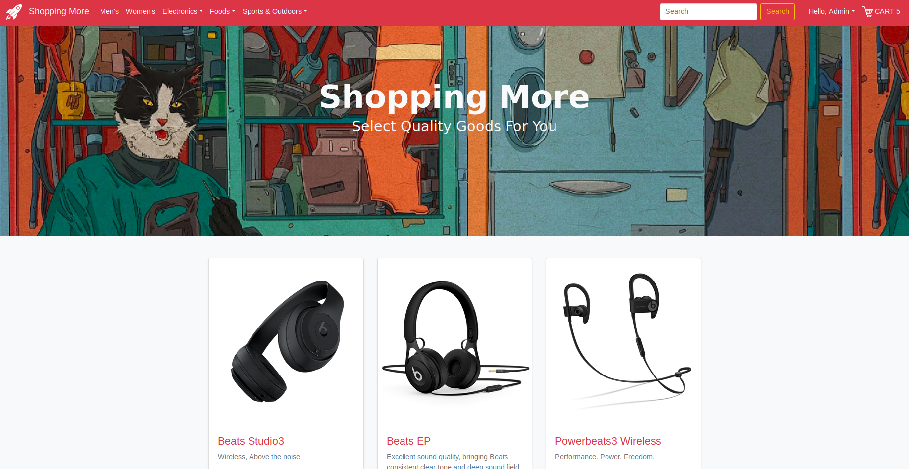
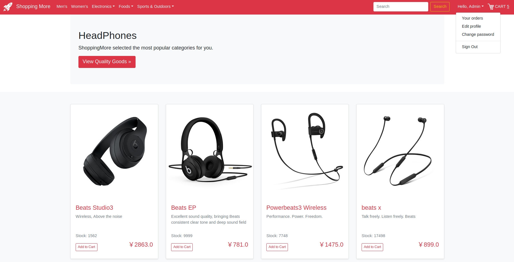
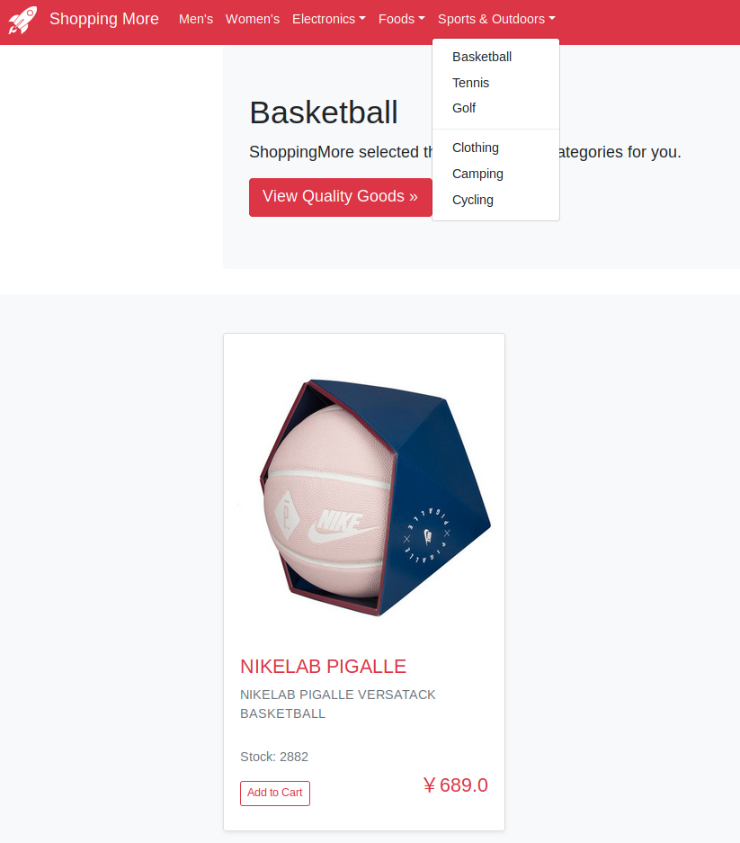
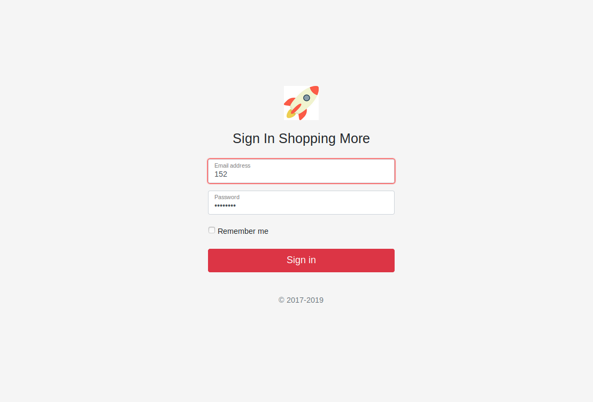
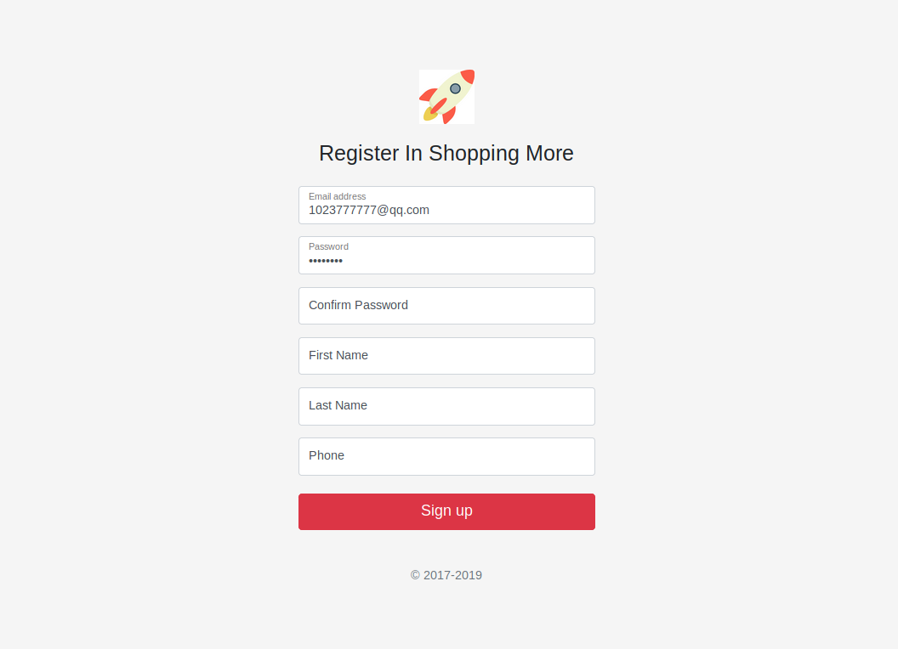
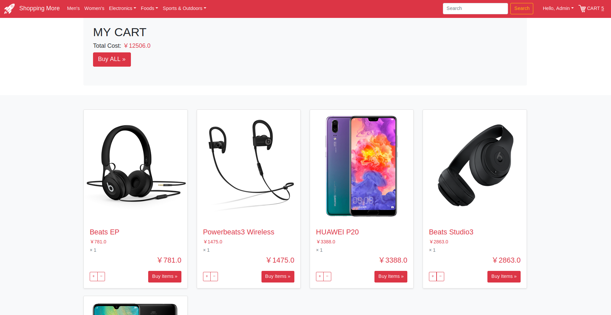

# Shopping More
> A simple and comfortable shopping-mall app on Flask-bootstrap framework.
### 1. How to setup
- Environment: Linux, Python3.6

Download source code: 
```shell
$ git clone https://github.com/icepoint666/shopping-more.git
```
Install dependent packages:
```shell
$ cd shopping-more
$ sudo pip3 install -r requirement.txt
```
(If it can't import sqlite3, please follow [here](https://icepoint666.github.io/2019/02/12/sqlite3-install/) to install it.)

Run it:
```shell
$ python3 app.py
```
("database.py" is used to initialize the database.

"database.db" is stored with some of uploaded information.)

Access the index-page locally (but online):
```
http://localhost:5000
```

### 2. User Interface Display

- Home



- Find item by category





- Login



- Register



- My Cart



- My Orders


if administrator needs to add item or remove item from shopping-more.

Go to following URLs:
```buildoutcfg
http://localhost:5000/add
http://localhost:5000/remove  (Click photos of items to remove this item)
```

### 3.To-do-list
- [ ] Create administrator account
- [ ] Search items
- [ ] View description-page of each item
- [ ] Dynamic stock number
- [x] Remove items
